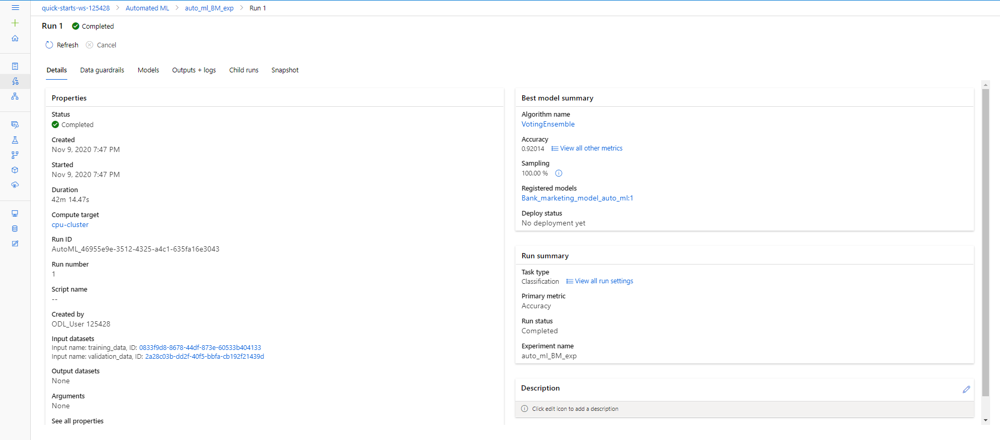
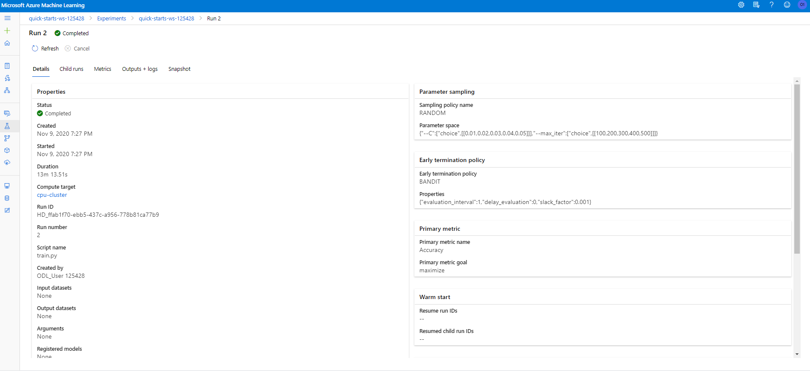
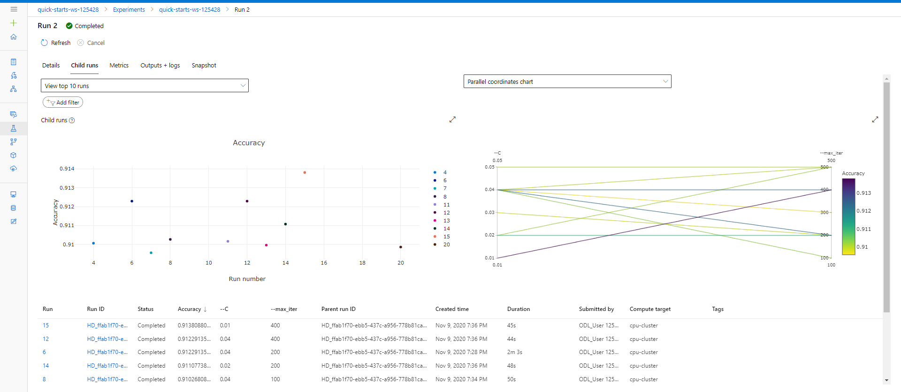
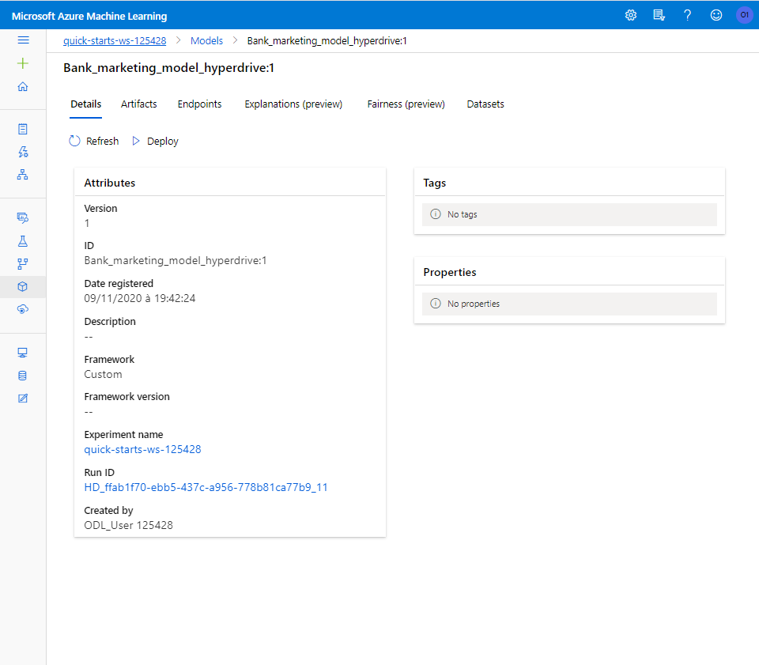
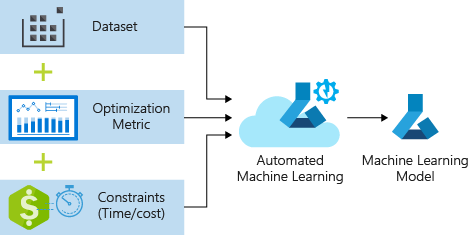
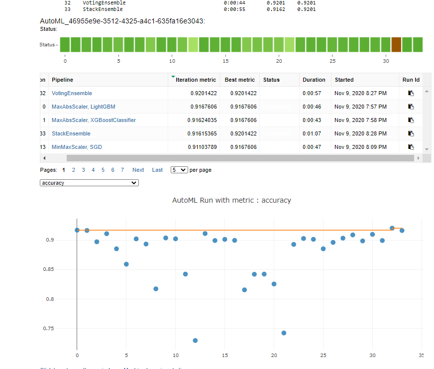
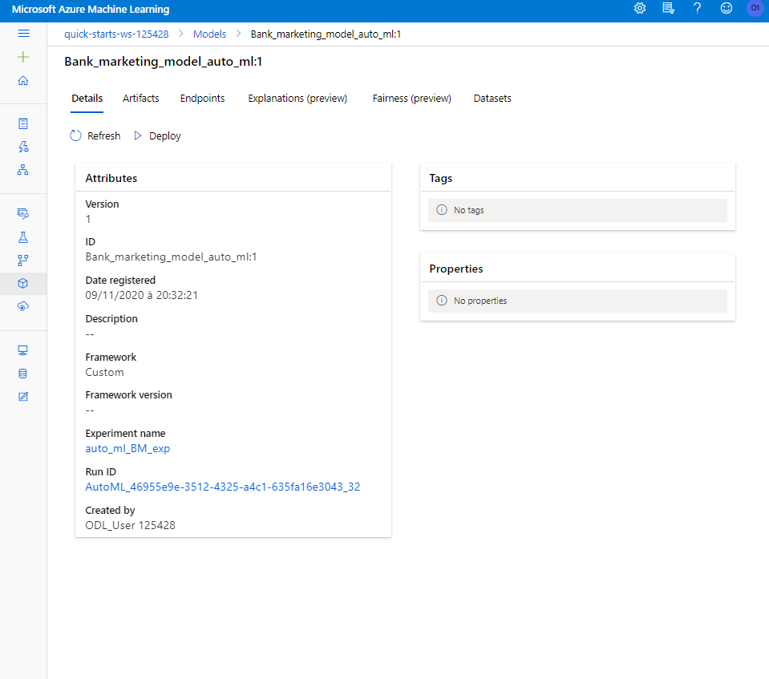
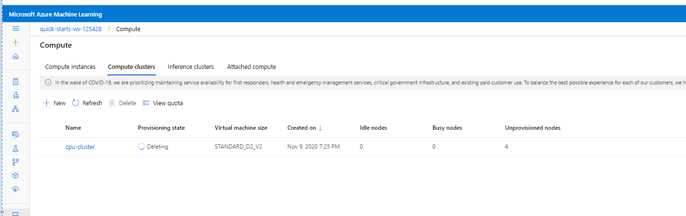

# Optimizing an ML Pipeline in Azure

## Overview
**This project is part of the Udacity Azure ML Nanodegree.**

Where we start by building and optimizing an Azure ML pipeline using the Python SDK and a provided Scikit-learn model. Once finished we compare the accuracy of the best model to an Azure AutoML run. 

## Summary
The Goal of this project is to predict if a client will subscribe to a terme deposit product (Variable value: ('yes') ,('no')) by using a dataset  (located  : https://www.kaggle.com/henriqueyamahata/bank-marketing ) related to direct marketing campaigns of a Portuguese banking institution.

**The main step of the project are :**

1. Create a model using Azure Python SDK and a LogisticRegression model
2. Tune the parameter of the Scikit-learn model using hyperdrive 
3. Create a Model using Azure Auto ML 
4. Compare the best performing model between the two created solutions based on their Accuracy 

**The best model is  :**

The best performing model **Using the VotingEnsemble Algorithm** with the Accuracy of **0.92014** was the result of the **Auto ML run.**

## Scikit-learn Pipeline :

The process of the created Pipeline is composed of two principal Step : 

  A. Create the Model using Python : (**train.py**)

1. Create the TabularDataset by using TabularDatasetFactory
2. Clean the data by using One hote encoding technique to deal with the discret features 
3. Split the data into training and testing sets.
4. Create the model using the LogisticRegression model.
5. Calculat the model Accuracy

  B. Tune the model Parameters using Hyperdrive  : (**udacity-project.ipynb**)
The parameters are **(C : "Inverse of regularization strength" , max_iter : "Maximum number of iterations to converge")**

1. Define the parameter sampling method to use over the hyperparameter space where we specify a liste of discret value used during the tuning *this choice of value was made after multiple execution of the hyperdrive run*
2. Specify the early stopping policy to Automatically terminate poorly performing runs every time the training script reports the primary metric
4. Create the SKLearn estimator 
5. Define the hyperdrive configuration , submit the run and register the best model **(C = 0.01 , max_iter = 400 give an Accuracy of 0.913)** using the result of the parameter tunning 

## AutoML

The process of the created solution is composed of tree principal Step : 

  A. Define the Tabular dataset ,clean  the data and specify the training and the testing sets  (**like the Scikit-learn Pipeline**)
  
  B. Specify the configuration for the auto ML run
  
  
  
  C. Submit the run and register the best model **(VotingEnsemble Algorithm and the Accuracy is 0.92014)**  
  
 
 
  
  
## Pipeline comparison

To compare the difference of the two model we used the Accuracy as a primay metric and the result was that Auto ML give better performance.
This result is logical mostly because Auto-ML  run not ony test more hyperparameter than the Scikit-learn process but also more model too 

## Future work

The impovement can be made not only in the Auto ml process by trying to handel the Imbalanced data by not using the cleand data function and leave the featurization to the Auto ML run. but also in the Scikit-learn process by using other algorithm and testing odher configuration to tune the hyperparameter

## Proof of cluster clean up

once finished we delete the compute instance and the compute cluster used during this project  to not incur any charges.

 
  

