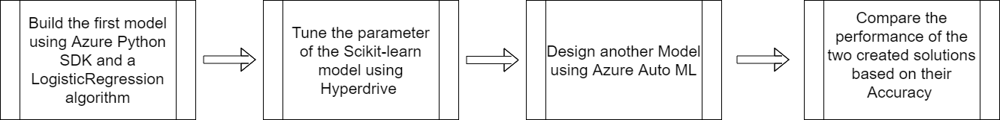
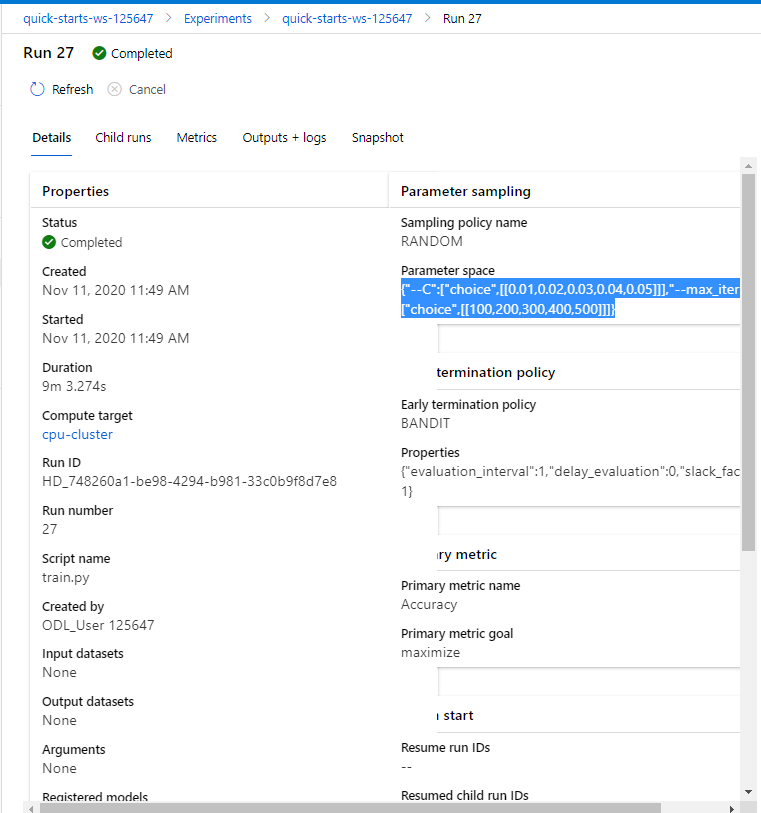
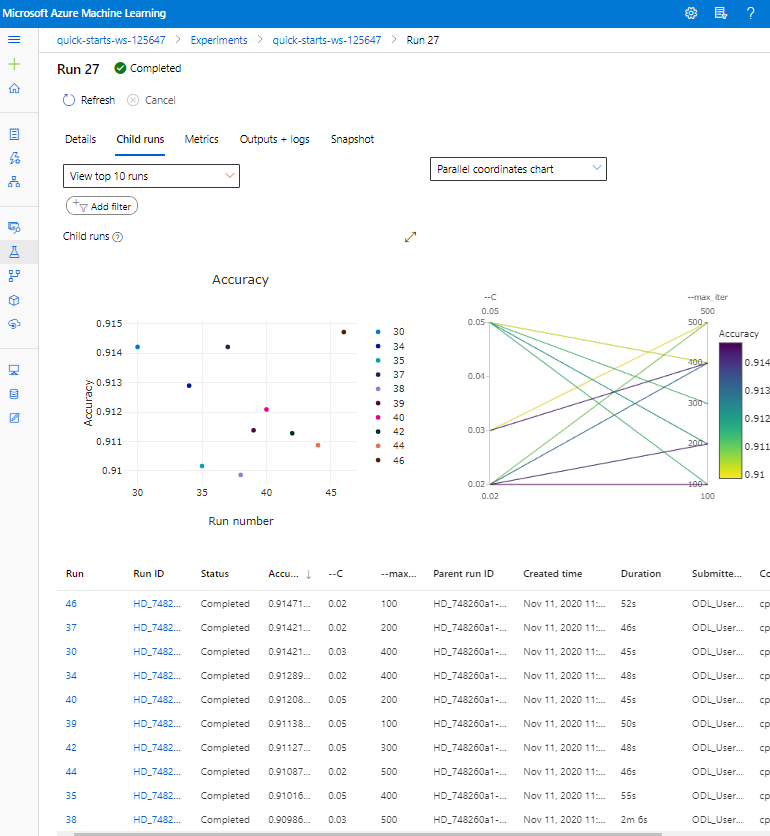
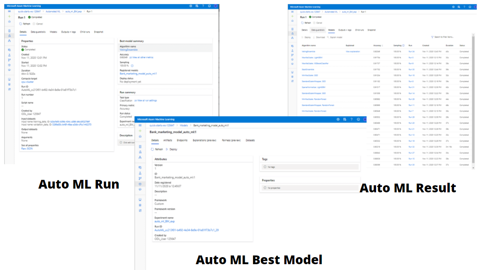
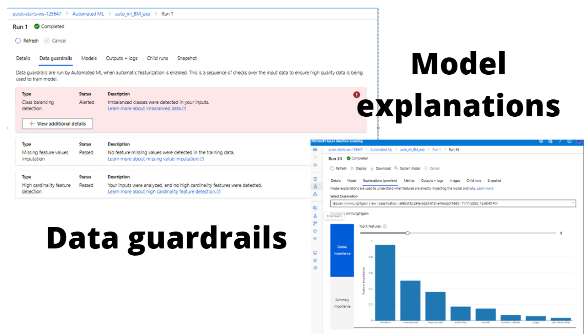
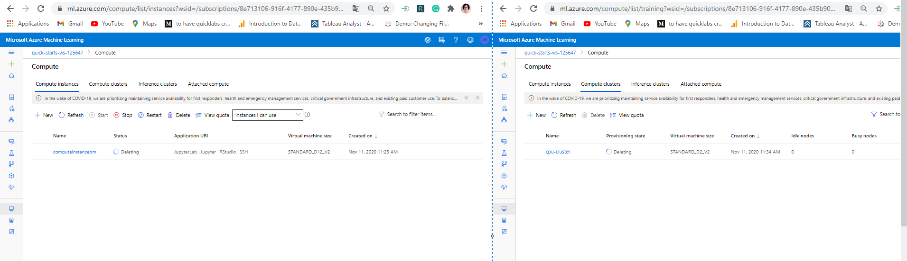

# Optimizing an ML Pipeline in Azure

## Overview
**This project is part of the Udacity Azure ML Nanodegree.**

Where we start by building and optimizing an Azure ML pipeline using the Python SDK and a provided Scikit-learn model. Once finished we compare the accuracy of the best model to an Azure AutoML run. 

## Summary of the project 
The purpose of this project is to predict if a client will subscribe to a term deposit product by using a dataset  (located here: https://www.kaggle.com/henriqueyamahata/bank-marketing ) related to direct marketing campaigns of a Portuguese banking institution by using Azure ML pipeline (Python SDK) and Azure AutoML in two different process.

Once the two experiments over and the best models generated we compared their performance using the **Accuracy** as a primary metric, which leads us to conclude that the best solution resulting from the **Auto ML run** is a model based on the **VotingEnsemble Algorithm** because he give us an **Accuracy of 0.92014**

# Table of contents
1. [Scikit-learn Pipeline](#Scikit)
    1. [Create the Model using Python](#subparagraph1)
    2. [Tune the Parameters using Hyperdrive](#subparagraph2)
    3. [Result](#subparagraph3)
2. [AutoML Pipeline](#AutoML)
    1. [Preparation](#subparagraph11)
    2. [Configuration and Run](#subparagraph12)
    3. [Result](#subparagraph13)
3. [Pipeline comparison](#comparison)
4. [Future work](#Future)

## Description of the Scikit-learn Pipeline :

Below a description of the model creation and the choices made during this first step of the project :

  **A. Create the Model using Python :** (**train.py**) 

We start  first by creating a tabular dataset **TabularDatasetFactory** from the the datasource to do some exploration and understind the meaning of each features once than we start to prepare and clean the data by using one hot encodig technique to deal with discrete features , after the preparation we split the result to training and testing sets. 

We then move to choising the best algorithm for our classification problem, which is **LogisticRegression** because we are trying  to predict if a client will subscribe to a term deposit product (yes or no) which mean **two (and only two) outcomes** . After the creation of the model we calculate it's **Accuracy**

Choosing the model based on only two parameters and after one run does not ensure that it will be functional in production which move us to the second step of this pipeline **Tune the model Parameters using Hyperdrive**

 **B. Tune the model Parameters using Hyperdrive  :** (**udacity-project.ipynb**) 
  
To improve the Accuracy of our model we optimize our hyperparameters using Azure Machine Learning's tuning capabilities **Hyperdrive**.

First of all  , we define the hyperparameter space to sweep over. which mean tuning the **C** and **max_iter** parameters. In this step we use random sampling **RandomParameterSampling** to try different configuration sets of hyperparameters to maximize our primary metric, Accuracy.
*We use RandomParameterSampling which Defines random sampling over a hyperparameter search space to sample from a set of discrete values for max_iter and C hyperparameters. This will make the hyperparameter tunning choice more specific*

We then define our termination Policy for every run using **BanditPolicy** based on a slack factor equal to 0.01 as criteria for evaluation to  conserves resources by terminating runs that are poorly performing.
*This choice means that the primary metric of every run Y using this formula (Y + Y * 0.01) will be compared to the best metric of the hyperdrive execution, and if smaller, it cancels the run. this will assure that every run will give better accuracy than the one before*

Once than we create SKLearn estimator , Define the hyperdrive configuration and finally, lauch the hyperparameter tuning job.

 **C. Result of the Scikit-learn Pipeline:** 

We run this Pipeline mutiple time and do some changes to the Hyperdrive configuration to improve our Accuracy and once satisified  we register our model for future use.
In this case the best model was generated using this hyperparameters **(C = '0.02', max_iter = '100')** and give us an  **Accuracy of 0.91471927**

*The execution of this process means runnig this model mutiple times using different value of the parameters and in the same time comparing the result of each run to choose the best hyperparameter at the end*

## AutoML 

Below a description of the AutoML process and the choices made during this second step of the project :

  **A. Preparation of the data : **

We start First by defining the Tabular dataset  from the datasource , clean the data by using one hot encoding  and specify the training and the testing sets (**similar to the Scikit-learn Pipeline**)
  
  **B. Configuration and Run of the AutoML process  : **
  
   
    
We move then to the AutoML configuration where we specify the type of  the task **Classification** , the primary metric **Accuracy** , the data , the column we want to predict and the constraint. We finelly Call the submit method on the experiment object and pass the run configuration.Once finished we register the model for future use
In this case the best model was generated using **VotingEnsemble Algorithm** which involves summing the predictions made by multiple other classification models and give us an  **Accuracy of 0.92049**

   

  **C. Result AutoML process  : **

Before running AutoML Start first by checking over the input data to ensure high quality is being used to train model where he use class balancing detection , Missing Feature values imputation  and high cardinality feature detection.

After the exuction the AutoML Result not to only includ the best model resulting from the runnign of mutiple classification algorithm  but he also deliver intersting information to undertand more why this choise of model was made in this case of problem by understanding what features are directly impacting the model and why.

  

  
## Pipeline comparison 

To analyze the distinction among the two models we used the Accuracy as a primary metric and the outcome was that Auto ML provides more high-grade performance.
This result is coherent mostly because Auto ML run not only test more hyperparameter value than the Scikit-learn process but also more algorithm too 

## Future work 

The improvement can be made not only in the Auto ml process by not using the cleaned data function (train.py) and leave the featurization to the Auto ML run **(to handle the Imbalanced data)** . but also in the Scikit-learn process by using other algorithm and testing other configuration to tune the hyperparameter

## Proof of cluster clean up 

Once finished we delete the compute instance and the compute cluster used during this project to not incur any charges.

 

